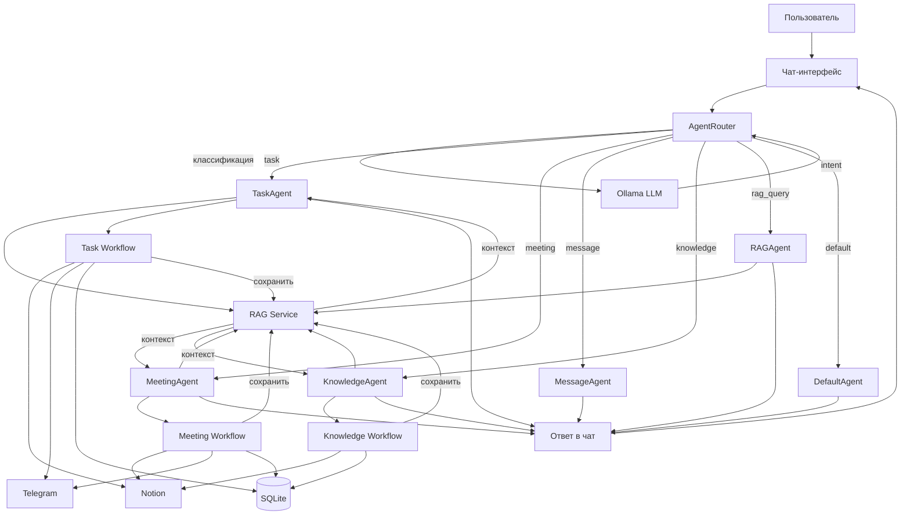
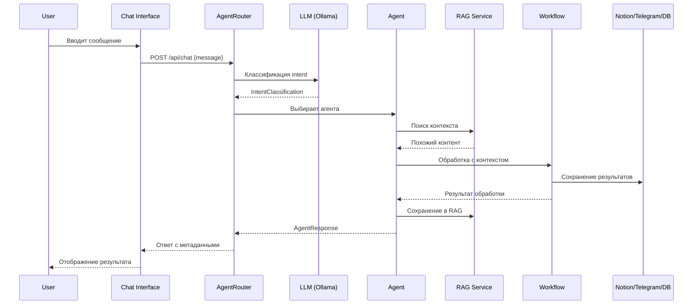

# Архитектура: Чат с агентами

## Текущая архитектура (проблемы)

```
User → Выбор типа → Форма → Workflow → Результат
         ↑
    Нужно выбирать вручную
```

## Новая архитектура (решение)



## Поток обработки сообщения



## Компоненты системы

### Frontend

```
ChatInterface (главный)
├── MessageList (история)
│   └── MessageBubble (одно сообщение)
├── ChatInput (поле ввода)
├── QuickActions (быстрые действия)
│   ├── "Обработать последнюю встречу"
│   ├── "Мои задачи"
│   └── "Поиск по знаниям"
└── AgentBadge (индикатор агента)
```

### Backend

```
AgentRouter
├── classify() - классификация через LLM
└── route() - маршрутизация к агенту

Agents/
├── BaseAgent (базовый класс)
│   ├── get_rag_context()
│   ├── process()
│   └── save_to_rag()
├── TaskAgent
├── MeetingAgent
├── MessageAgent
├── KnowledgeAgent
├── RAGAgent
└── DefaultAgent
```

## Интеграция RAG

Каждый агент:
1. **Получает контекст** из RAG перед обработкой
2. **Использует контекст** для обогащения ответа
3. **Сохраняет результат** в RAG после обработки

```python
# Пример TaskAgent
async def process(self, user_input: str):
    # 1. Контекст из RAG
    similar_tasks = await self.rag.search_similar_tasks(user_input)
    
    # 2. Обработка с контекстом
    result = await self.task_workflow.process(
        user_input,
        context=similar_tasks
    )
    
    # 3. Сохранение в RAG
    await self.rag.add_task(result)
    
    return result
```

## Преимущества новой архитектуры

1. **Автоматизация** - не нужно выбирать тип действия
2. **Контекст** - каждый агент использует RAG
3. **Единый интерфейс** - один чат вместо множества форм
4. **Расширяемость** - легко добавить новых агентов
5. **Прозрачность** - видно какой агент обрабатывает
